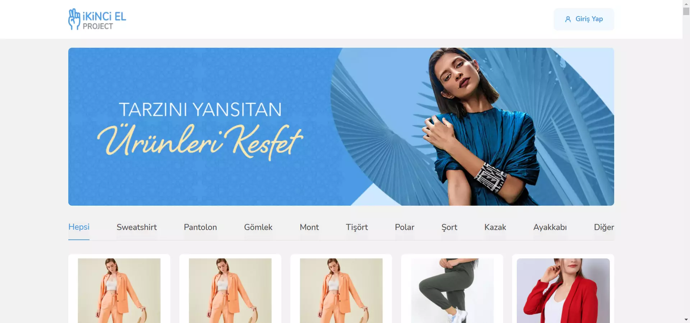
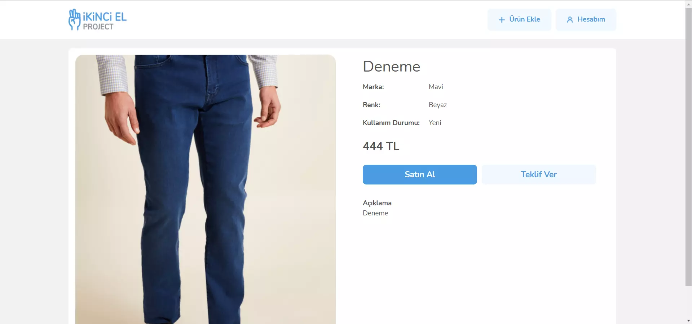
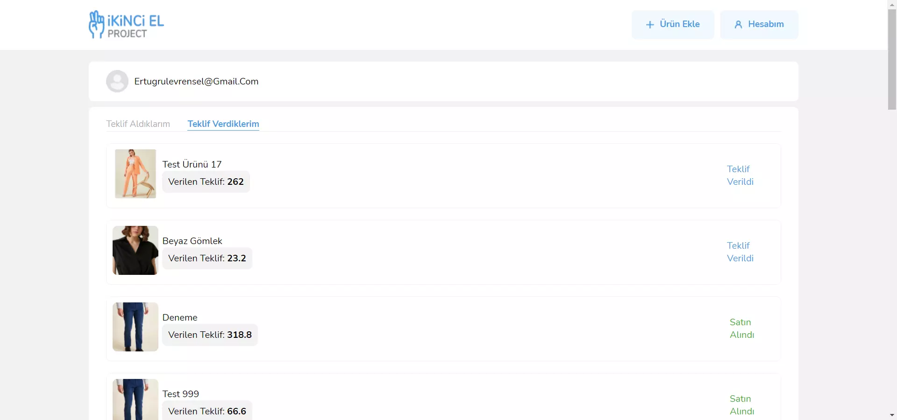
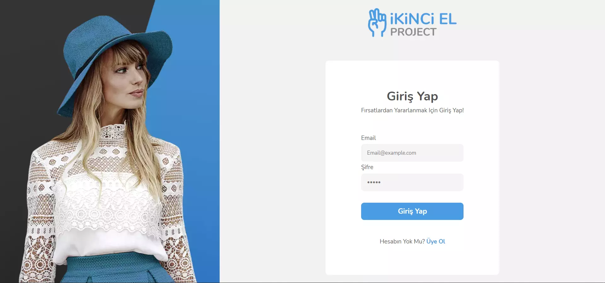
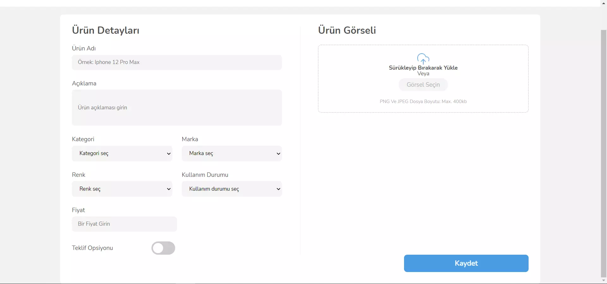
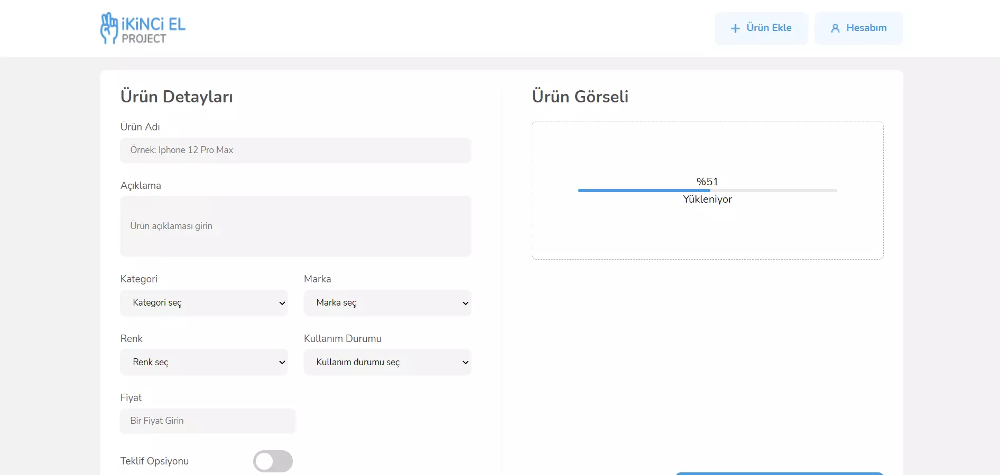
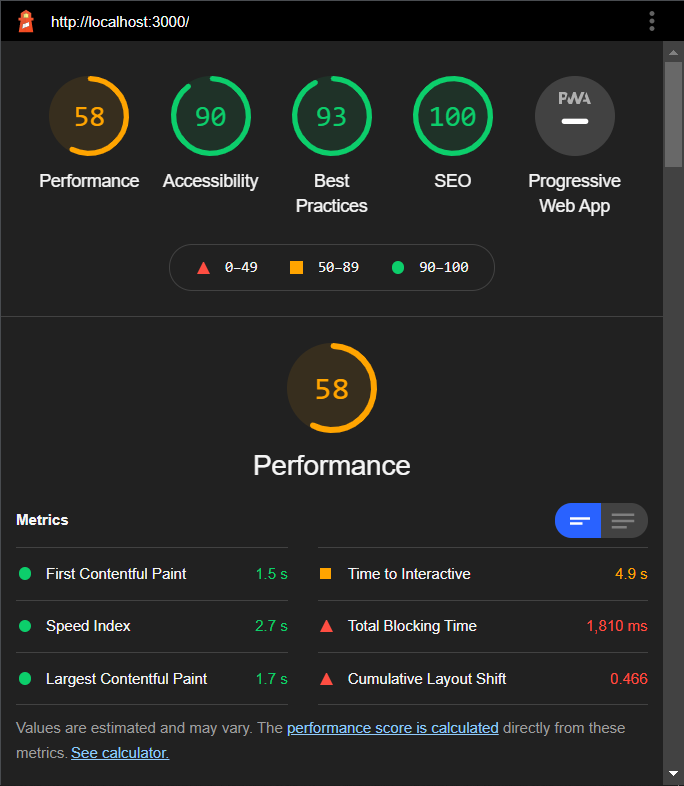
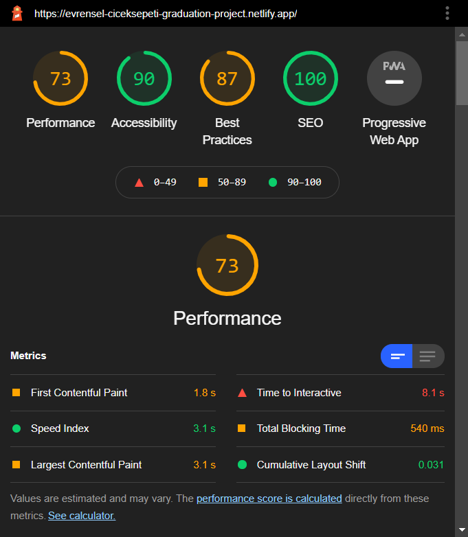

# E-Commerce Project

This project made within the Çiçeksepeti react bootcamp.

LIVE: https://evrensel-ecommerce-project.netlify.app/

## Used Technologies

- React
- React redux
- Redux thunk
- Redux devtool extension
- React dom
- Axios
- Babel
- Testing library
- Jest

## Run Project

In the project directory you can run:

```console
npm install
npm start
```

## Test Project

To run unit tests you can run the following lines:

```console
npm run test
```

## Screenshots








## Performance

### Localhost Desktop


### Localhost Mobile



### Live Demo Desktop


### Live Demo Mobile


